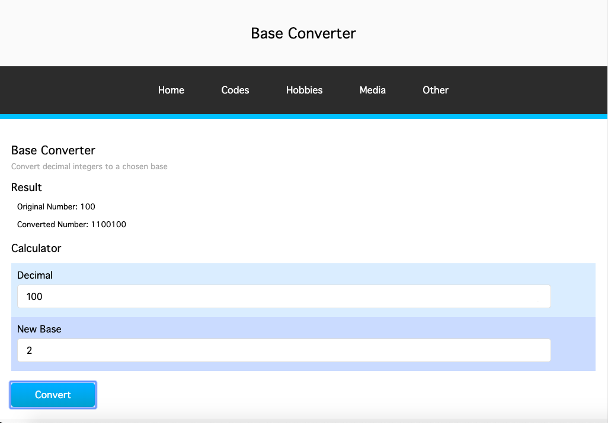

# Base Converter

## How To Open
> 1. Open the application's folder
> 2. Right click on the click named _index.html_
> 3. Choose the _open with_ option
> 4. Open the file in your desired browser

## How To Use
> 1. Enter a decimal number into the first input field
> 2. Enter the base you want it converted to into the second input field
> 3. Press the _Convert_ button
> 4. The entered decimal number and converted number will be displayed

## Requirements
> 1. This application requires a browser to run
> 2. The browser must have JavaScript available and enabled

## User Stories
> 1. Users can convert decimal numbers to a chosen base

## Errors
> 1. Bases above 36 are not functioning correctly

## Preview
<!-- todo -->

